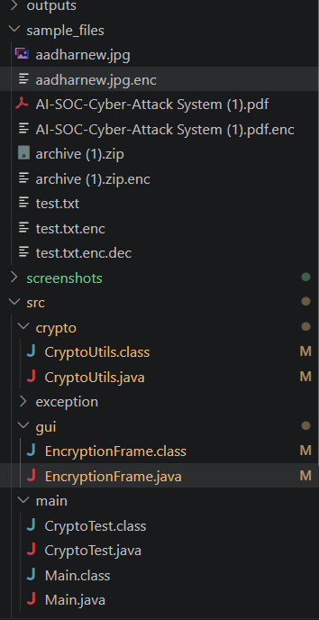
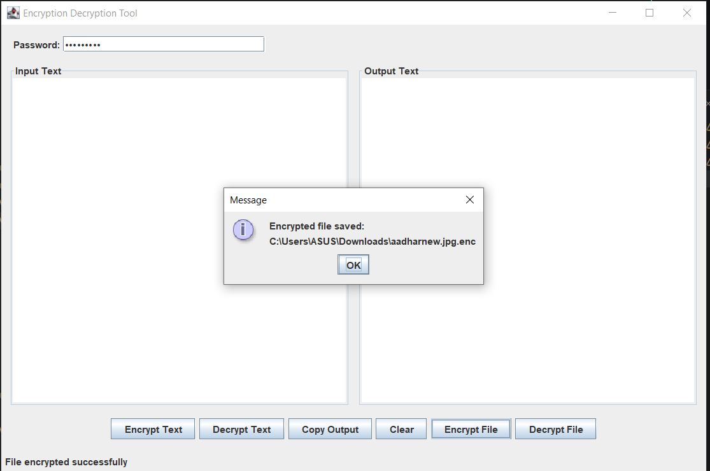
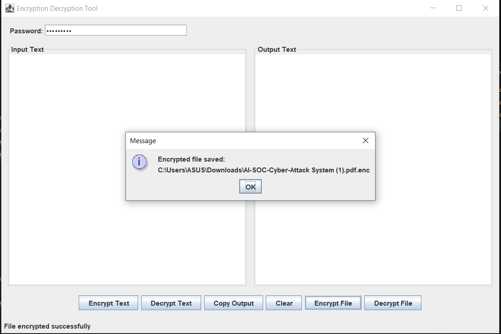
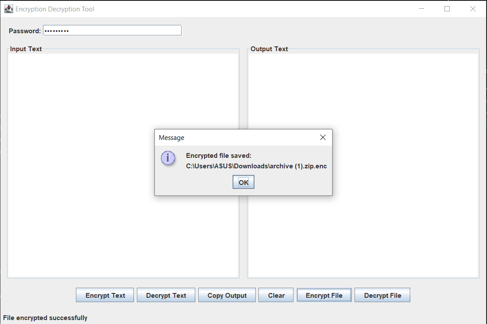
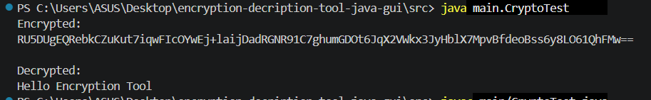
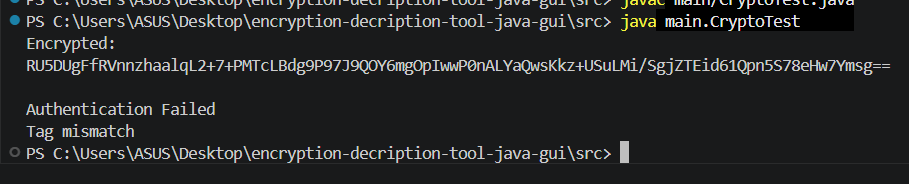

# 🔐 Encryption & Decryption Tool (Java Swing)

<div align="center">


**A secure Java desktop application for encrypting and decrypting text and files using modern cryptographic standards.**

</div>

---

# 📌 Overview

The **Encryption & Decryption Tool** is a desktop application developed in **Java Swing** that enables users to securely encrypt and decrypt both **text** and **binary files** using password-based encryption.

Unlike many academic encryption projects that only support text files, this application is designed to work with virtually any file type including:

- PDF
- DOCX
- ZIP
- PNG
- JPG
- EXE
- MP4
- MP3
- TXT
- and many more.

The project combines a user-friendly graphical interface with modern cryptographic techniques such as **AES-256 GCM**, **PBKDF2**, and **SHA-256** to provide confidentiality, authentication, and integrity verification.

---

# ✨ Features

## 🔒 Text Encryption

- Encrypt plain text
- Decrypt encrypted text
- Password-based encryption
- AES-GCM authenticated encryption
- Base64 encoded encrypted output

---

## 📁 File Encryption

Supports encryption and decryption of almost every file type:

- 📄 PDF
- 🖼 JPG
- 🖼 PNG
- 📦 ZIP
- 📄 DOCX
- 🎵 MP3
- 🎬 MP4
- ⚙ EXE
- 📃 TXT
- Any binary file

---

## 🛡 Security Features

- AES-256 GCM Encryption
- PBKDF2 Password Key Derivation
- 120000 PBKDF2 Iterations
- Random Salt Generation
- Random Initialization Vector (IV)
- SHA-256 Integrity Verification
- Authentication Failure Detection
- Password-Based Encryption
- Binary-Safe Encryption
- Secure Encrypted File Container

---

## 🖥 GUI Features

- Java Swing Interface
- Input Text Area
- Output Text Area
- Password Field
- Encrypt Text Button
- Decrypt Text Button
- Encrypt File Button
- Decrypt File Button
- Copy Output Button
- Clear Button
- Status Bar
- File Chooser Integration

---

# 📸 Screenshots

## Main Application

> Replace these screenshots with your latest screenshots if necessary.

### Main Window



---

### Image Encryption



---

### PDF Encryption



---

### ZIP Encryption



---

# 🏗 Project Architecture

```text
                +--------------------+
                |   Java Swing GUI   |
                +---------+----------+
                          |
                          |
                          ▼
                 EncryptionFrame.java
                          |
                          |
                          ▼
            FileEncryptionService.java
                          |
                          |
                          ▼
                 CryptoUtils.java
                          |
      +-------------------+------------------+
      |                                      |
      ▼                                      ▼
 AES-256 GCM                         PBKDF2 Key Derivation
 Encryption                           SHA-256 Integrity
```

---

# 📂 Project Structure

```text
encryption-decryption-tool-java-gui
│
├── screenshots/
│   ├── phase7.png
│   ├── imagenc.png
│   ├── pdfenc.png
│   └── zip.png
│
├── sample_files/
│   ├── test.txt
│   ├── test.txt.enc
│   └── test.txt.enc.dec
│
├── src/
│   │
│   ├── crypto/
│   │     ├── CryptoUtils.java
│   │     ├── CryptoException.java
│   │     └── DecryptedData.java (if separated)
│   │
│   ├── service/
│   │     └── FileEncryptionService.java
│   │
│   ├── gui/
│   │     └── EncryptionFrame.java
│   │
│   ├── main/
│   │     ├── Main.java
│   │     └── CryptoTest.java
│   │
│   └── utils/
│         └── (Optional logging utilities)
│
├── README.md
└── LICENSE
```

---

# 🛠 Technology Stack

| Category | Technology |
|----------|------------|
| Language | Java |
| GUI | Java Swing |
| Encryption | AES-256 GCM |
| Key Derivation | PBKDF2WithHmacSHA256 |
| Integrity | SHA-256 |
| Randomness | SecureRandom |
| Build Tool | javac |
| IDE | VS Code / IntelliJ IDEA |
| Platform | Windows / Linux / macOS |

---

# 🔐 Cryptography Used

## AES-256 GCM

AES (Advanced Encryption Standard) is one of the world's most trusted symmetric encryption algorithms.

This project uses:

- AES-256
- GCM Mode
- NoPadding

AES-GCM provides:

- Confidentiality
- Authentication
- Integrity Protection

---

## PBKDF2

Instead of directly using the password as an encryption key, this project derives a secure key using:

- PBKDF2WithHmacSHA256
- 120000 iterations
- Random 16-byte salt
- 256-bit key generation

This significantly improves resistance against brute-force and dictionary attacks.

---

## SHA-256

SHA-256 is used to verify file integrity after decryption.

The application detects:

- File tampering
- Data corruption
- Authentication failures
- Wrong passwords

---

## 🚀 Key Highlights

- Modern AES-GCM authenticated encryption
- Binary-safe encryption for any file type
- Password-based key derivation with PBKDF2
- SHA-256 integrity verification
- User-friendly Java Swing desktop interface
- Clean modular project structure
- Suitable for educational and portfolio purposes

---

# ⚙ Installation

## Prerequisites

Before running the project, ensure the following software is installed:

- Java JDK 17 or later
- Git
- VS Code / IntelliJ IDEA (Recommended)

Verify Java installation:

```bash
java -version
javac -version
```

---

# 📥 Clone Repository

```bash
git clone https://github.com/vyawaha/encryption-decryption-tool-java-gui.git
```

Move into the project directory:

```bash
cd encryption-decryption-tool-java-gui
```

---

# ▶ Compile Project

Open Terminal / PowerShell inside the **src** directory.

```powershell
cd src

javac crypto/*.java service/*.java gui/*.java main/*.java
```

---

# ▶ Run Application

```powershell
java main.Main
```

The Java Swing GUI will launch.

---

# 🚀 How to Use

## 1️⃣ Text Encryption

1. Launch the application.
2. Enter plain text into the **Input Text** area.
3. Enter a password.
4. Click **Encrypt Text**.
5. The encrypted output is displayed in the **Output Text** area.

---

## 2️⃣ Text Decryption

1. Paste encrypted text into the **Input Text** area.
2. Enter the same password used during encryption.
3. Click **Decrypt Text**.
4. The original text appears in the **Output Text** area.

---

## 3️⃣ File Encryption

1. Click **Encrypt File**.
2. Select any supported file.
3. Enter a password.
4. The encrypted file is saved with:

```text
filename.ext.enc
```

Example:

```text
report.pdf
```

becomes

```text
report.pdf.enc
```

---

## 4️⃣ File Decryption

1. Click **Decrypt File**.
2. Select the encrypted file.

Example:

```text
report.pdf.enc
```

3. Enter the correct password.
4. The decrypted file is restored.

---

# 📁 Supported File Types

The application supports virtually every binary and text file format.

| Category | Examples |
|----------|----------|
| Documents | PDF, DOC, DOCX, TXT |
| Images | PNG, JPG, JPEG, BMP |
| Archives | ZIP, RAR (as binary data) |
| Audio | MP3, WAV |
| Video | MP4, AVI |
| Executables | EXE |
| Source Code | Java, Python, C, C++, HTML |
| Others | Any binary file |

---

# 🔄 Encryption Workflow

```text
User Input
     │
     ▼
Password
     │
     ▼
PBKDF2 Key Derivation
     │
     ▼
AES-256 GCM Encryption
     │
     ▼
Encrypted Container
     │
     ▼
Save .enc File
```

---

# 🔓 Decryption Workflow

```text
Encrypted File
      │
      ▼
Read Container
      │
      ▼
Verify Header
      │
      ▼
Generate AES Key
      │
      ▼
AES-GCM Authentication
      │
      ▼
SHA-256 Integrity Check
      │
      ▼
Restore Original File
```

---

# 📦 Secure Encrypted File Format

Each encrypted file stores the following information:

```text
+------------------------------------------------------+
| MAGIC HEADER                                         |
+------------------------------------------------------+
| VERSION                                               |
+------------------------------------------------------+
| ORIGINAL FILE NAME                                    |
+------------------------------------------------------+
| ORIGINAL FILE SIZE                                    |
+------------------------------------------------------+
| SHA-256 HASH                                          |
+------------------------------------------------------+
| RANDOM SALT                                            |
+------------------------------------------------------+
| RANDOM IV                                              |
+------------------------------------------------------+
| AES-GCM ENCRYPTED DATA                                 |
+------------------------------------------------------+
```

This design allows the application to validate encrypted files before decryption and detect corruption or incorrect passwords.

---

# 🧪 Example Test Cases

### ✅ Text Encryption

Input:

```text
Hello Encryption Tool
```

Password:

```text
password123
```

Output:

```text
RU5DUg...
```

---

### ✅ File Encryption

Input:

```text
photo.jpg
```

Output:

```text
photo.jpg.enc
```

---

### ✅ PDF Encryption

Input:

```text
document.pdf
```

Output:

```text
document.pdf.enc
```

---

### ✅ ZIP Encryption

Input:

```text
archive.zip
```

Output:

```text
archive.zip.enc
```

---

### ❌ Wrong Password

Attempting to decrypt with an incorrect password results in an authentication failure, preventing unauthorized access to the original data.

---

# 📈 Project Progress

| Phase | Status |
|--------|--------|
| Project Setup | ✅ |
| Java Swing GUI | ✅ |
| AES Encryption Module | ✅ |
| GUI Integration | ✅ |
| File Encryption | ✅ |
| Binary Safe Encryption | ✅ |
| Secure File Workflow | ✅ |
| Secure Encryption Container | ✅ |

---

# 💡 Design Principles

This project was built with the following objectives:

- Modular architecture
- Separation of GUI and cryptographic logic
- Reusable encryption utilities
- Binary-safe file processing
- Password-based security
- Clean and maintainable Java code
- Beginner-friendly project structure suitable for learning and portfolio demonstration

---

# 📂 Project Structure

```
encryption-decryption-tool-java-gui/
│
├── src/
│   ├── crypto/
│   │   ├── CryptoUtils.java
│   │   ├── CryptoException.java
│   │   └── ...
│   │
│   ├── gui/
│   │   ├── EncryptionFrame.java
│   │   └── ...
│   │
│   ├── service/
│   │   ├── FileEncryptionService.java
│   │   └── ...
│   │
│   └── main/
│       ├── Main.java
│       └── CryptoTest.java
│
├── screenshots/
│   ├── phase1.png
│   ├── phase2.png
│   ├── phase3.png
│   ├── phase4.png
│   ├── phase5.png
│   ├── phase6.png
│   ├── phase7.png
│   ├── imagenc.png
│   ├── pdfenc.png
│   └── zip.png
│
├── sample_files/
│
├── README.md
│
└── LICENSE
```

---

# ⚙️ Installation

### Clone Repository

```bash
git clone https://github.com/vyawaha/encryption-decryption-tool-java-gui.git
```

---

### Open Project

Open in

- IntelliJ IDEA
- Eclipse
- VS Code

---

### Compile

```bash
cd src

javac crypto/*.java service/*.java gui/*.java main/*.java
```

---

### Run

```bash
java main.Main
```

---

# 💻 Application Workflow

## Text Encryption

1. Enter plain text
2. Enter password
3. Click **Encrypt Text**
4. Copy encrypted text

---

## Text Decryption

1. Paste encrypted text
2. Enter same password
3. Click **Decrypt Text**
4. Original text is restored

---

## File Encryption

1. Click **Encrypt File**
2. Select any file
3. Choose password
4. Encrypted file (.enc) is created

---

## File Decryption

1. Click **Decrypt File**
2. Select encrypted file
3. Enter correct password
4. Original file is restored

---

# 🛡 Security Features

- AES-256 Encryption
- GCM Authenticated Encryption
- PBKDF2-HMAC-SHA256
- Random Salt
- Random IV
- SHA-256 Integrity Verification
- Password-Based Key Derivation
- Authentication Failure Detection
- Binary Safe Encryption
- Secure Container Format
- Base64 Support for Text Encryption
- Cross Platform Compatibility

---

# 🖥 GUI Features

- Java Swing Interface
- Dual Text Panels
- Password Field
- Encrypt Button
- Decrypt Button
- Copy Output
- Clear Output
- Encrypt File
- Decrypt File
- Status Bar
- Error Dialogs
- Success Notifications
- File Chooser Integration

---

# 📄 Supported File Types

This application supports encryption of virtually any file because it works directly with binary data.

Examples include:

- TXT
- PDF
- DOC
- DOCX
- XLS
- XLSX
- PPT
- PPTX
- JPG
- JPEG
- PNG
- GIF
- BMP
- MP3
- WAV
- MP4
- AVI
- ZIP
- RAR
- 7Z
- EXE
- DLL
- ISO
- CSV
- JSON
- XML
- HTML
- CSS
- Java Files
- Python Files
- C++
- Any Binary File

---

# 📸 Project Screenshots

## Application


---

## Binary File Encryption

### Image Encryption


---

### PDF Encryption


---

### ZIP Encryption


---

## Crypto Module Testing

### Successful Encryption and Decryption




### Wrong Password Detection




# 🧪 Testing

The application has been tested with multiple text inputs and binary file formats to verify correctness, integrity, and authentication.

### Text Encryption Tests

- ✅ Plain text encryption
- ✅ Plain text decryption
- ✅ Unicode text support
- ✅ Large text encryption
- ✅ Empty input validation
- ✅ Wrong password detection
- ✅ Authentication failure handling

---

### File Encryption Tests

- ✅ TXT Files
- ✅ PDF Files
- ✅ JPG Images
- ✅ PNG Images
- ✅ ZIP Archives
- ✅ Java Source Files
- ✅ Binary Files

---

### Security Tests

- ✅ Random Salt Generation
- ✅ Random IV Generation
- ✅ AES-GCM Authentication Tag Verification
- ✅ SHA-256 Integrity Verification
- ✅ Password-Based Key Derivation
- ✅ Tampered File Detection

---

# 🚀 Future Improvements

The project can be extended with several enterprise-grade capabilities.

### Planned Features

- Dark Mode UI
- Drag & Drop File Support
- Batch File Encryption
- Folder Encryption
- Recursive Directory Encryption
- Progress Bar
- Multi-threaded Encryption
- Secure File Deletion
- Compression Before Encryption
- Digital Signatures
- Public Key (RSA/ECC) Encryption
- Hardware Security Module (HSM) Support
- Cloud Storage Integration
- Automatic Update Checker
- Cross-Platform Installer
- Command Line Interface (CLI)
- Logging Dashboard
- Plugin Architecture
- Internationalization (i18n)
- Unit Testing with JUnit

---

# 📚 Concepts Demonstrated

This project demonstrates practical implementation of several important computer science and cybersecurity concepts.

### Cryptography

- Symmetric Encryption
- AES-256
- AES-GCM
- PBKDF2
- Secure Random Number Generation
- SHA-256 Hashing
- Authentication Tags
- Password-Based Encryption

### Java Programming

- Object-Oriented Programming
- Exception Handling
- File I/O
- Byte Streams
- Swing GUI Development
- Event Handling
- Java NIO
- Modular Architecture

### Software Engineering

- Layered Architecture
- Separation of Concerns
- Reusable Utility Classes
- Service Layer Design
- Error Handling
- Maintainable Code Structure

---

# 🎯 Learning Outcomes

Through this project, the following skills were applied:

- Java Swing GUI Development
- Cryptography Fundamentals
- Secure Password-Based Encryption
- Binary File Processing
- Java NIO File Operations
- Exception Handling
- Secure Coding Practices
- Desktop Application Development
- Software Architecture
- Git & GitHub Workflow

---

# 🤝 Contributing

Contributions are welcome.

If you would like to improve this project:

1. Fork the repository.
2. Create a new feature branch.
3. Commit your changes.
4. Push the branch.
5. Open a Pull Request.

---

# ⭐ Support

If you found this project helpful:

⭐ Star the repository

🍴 Fork the repository

🐞 Report bugs

💡 Suggest new features

---

# 👨‍💻 Author

**Muktai Vyawahare**

Computer Science Engineering Student

GitHub: https://github.com/vyawaha/encryption-decryption-tool-java-gui.git

---

# 📜 License

This project is licensed under the **MIT License**.

You are free to use, modify, and distribute this software in accordance with the terms of the license.

---

# 🙏 Acknowledgements

This project was inspired by modern encryption utilities and built using Java's standard cryptography libraries.

Special thanks to the Java community and open-source ecosystem for providing excellent documentation and APIs.

---

<div align="center">

## ⭐ If you like this project, please consider giving it a Star! ⭐

**Made with ❤️ using Java, Swing, and AES-256 Cryptography**

</div>